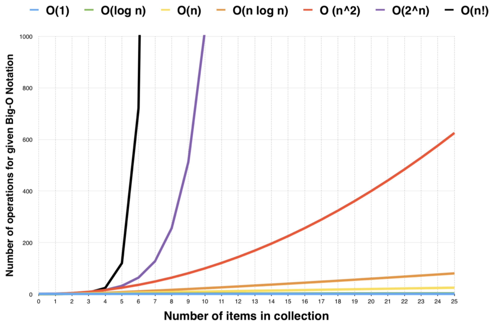

[TOC]

# 时间复杂度和空间复杂度分析
##Big O notation
从上到下, 所消耗的时间越来越多, 5次包括5次以下时间消耗差别不是很大
* O(1) : 常数复杂度  constant complexity
* O(log n) : 对数复杂度  logarithmic complexity
* O(n) : 对数复杂度  logarithmic complexity
* O(n^2) : 平方 N square complexity
* O(n^3) : 立方 N Cubic complexity
* O(2^n) : 指数  exponential growth 
* O(n!) : 阶乘 factorial 

###O(1)
例子:
```java
int n = 1000;
System.out.println("Hey - your input is: " + n);
```

```java
int n = 1000;
System.out.println("Hey - your input is: " + n); System.out.println("Hmm.. I'm doing more stuff with: " + n); System.out.println("And more: " + n);
//执行三次也是O(1) 复杂度
```

###O(log(n))
例子:
```java
for (int i = 1; i < n; i = i * 2) {
	System.out.println("Hey - I'm busy looking at: " + i);
}
```

###O(N)
例子:
```java
for (int i = 1; i <= n; i++) {
	System.out.println("Hey - I'm busy looking at: " + i);
}
```

```java
for (int i = 1; i <= n; i++) {
	System.out.println("Hey1 - I'm busy looking at: " + i);
}
for (int j = 1; j <= n; j++) {
	System.out.println("Hey2 - I'm busy looking at: " + j);
}
//2n的执行次数,时间复杂度也为O(N)
//可忽略`2`
```


###O(N^2)

```java
for (int i = 1; i <= n; i++) { 
	for (int j = 1; j <=n; j++) {
		System.out.println("Hey - I'm busy looking at: " + i + " and " + j);
	} 
}
```

###O(N^3)
```java
for (int i = 1; i <= n; i++) { 
	for (int j = 1; j <=n; j++) {
		for (int k = 1; k <=n; k++) {
			System.out.println("Hey - I'm busy looking at: " + i + " and " + j);
		}
	} 
}
```

###O(2^n)
//尽量避免指数和阶乘这样的复杂度
```java
int fib(int n) {
	if (n <= 2) return n;
	return fib(n - 1) + fib(n - 2);
}
```

###时间复杂度曲线
5次包括5次以下时间消耗差别不是很大

###参考连接
[时间复杂度和空间复杂度](https://www.zhihu.com/question/21387264)
[指数](https://www.shuxuele.com/algebra/exponents-logarithms.html)


##主定理(这块还不是很了解, 需要后面再次复习)


###参考连接
[主定理](https://zh.wikipedia.org/wiki/主定理)

##常见的算法的复杂度
* 二叉树遍历 - 前序、中序、后序:O(N) 
* 图的遍历:O(N) 
* 搜索算法:DFS、BFS - O(N) 
* 二分查找:O(logN)

