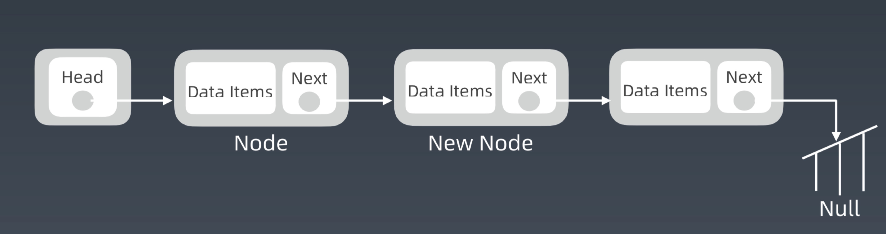
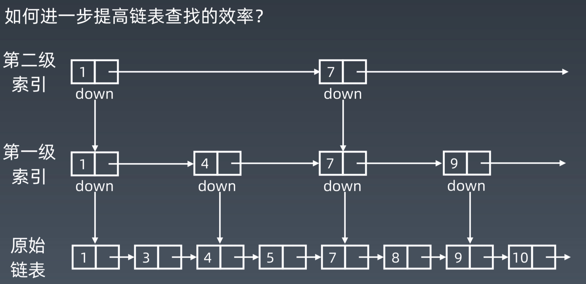

[TOC]

#数组,链表,跳表的基本实现和特性

##数组
计算机处理数组的时候, 会开辟一块连续的地址, 通过内存管理器访问
###特点
1. `查询`快, 时间复杂度为O(1)
2. 但是`增加`和`删除`很慢,时间复杂度为O(n)
3. `首位增加`,时间复杂度为O(1)--可变数组
4. `末位增加`, 时间复杂度为O(1)--可变数组

###ArrayList
###特点
1. `查询`快, 时间复杂度为O(1)
2. 但是`增加`和`删除`很慢,时间复杂度为O(n)
3. `首位增加`,时间复杂度为O(n)
4. `末位增加`, 如果容量够,O(1), 如果容量不够O(n)

ArrayList是java在数组的基础上封装了一成,大概原理:
```java
public void add(int index,E e){
  checkBoundInclusive(index);//检查是否 越界
  modCount++;//操作的次数,此处可以不注意
  if (size == data.length)
  	ensureCapacity(size + 1)//保证数组的size是足够的,数组在初始化的时候会分配连续的内存空间,这个函数检查如果空间不足,这会开辟新的*2的内存空间, 将老数组copy过来
  if (index != size)
  //第1位,第2位: data, index  //原数组
  //第3位,第4位: data, index + 1 //原地copy原数组并且预留一个位置 
  //第5位: size -index//在copy的时候, 需要外后挪一位
  	System.arraycopy(data, index, data, index + 1, size -index);
  data[index] = e;
  size++;
}
```

##链表-Linked List
###单项链表
```java
public class LinkedList{
	ListNode head;//链表的头节点
	
	//链表的节点类
  class ListNode {
       int val;//保存数据,还可以是其他类型, 比如基础类型,或者对象
       ListNode next;//指向下一个节点的指针,用于链接数组 
       ListNode(int x) { val = x; }//构造函数
  }
}
```


参考网址
[Implementing a Linked List in Java using Class](https://www.geeksforgeeks.org/implementing-a-linked-list-in-java-using-class/)

###java中是双向链表
```java
  76: public class LinkedList<T> 
  78: {
  84:   /**
  85:    * The first element in the list.
  86:    */
  87:   transient Entry<T> first;
  88: 
  89:   /**
  90:    * The last element in the list.
  91:    */
  92:   transient Entry<T> last;
  93: 
  94:   /**
  95:    * The current length of the list.
  96:    */
  97:   transient int size = 0;
  98: 
  99:   /**
 100:    * Class to represent an entry in the list. Holds a single element.
 101:    */
 102:   private static final class Entry<T>
 103:   {
 104:     /** The element in the list. */
 105:     T data;
 106: 
 107:     /** The next list entry, null if this is last. */
 108:     Entry<T> next;
 109: 
 110:     /** The previous list entry, null if this is first. */
 111:     Entry<T> previous;
 112: 
 113:     /**
 114:      * Construct an entry.
 115:      * @param data the list element
 116:      */
 117:     Entry(T data)
 118:     {
 119:       this.data = data;
 120:     }
 121:   } // class Entry
 122: }
```
[Source for java.util.LinkedList](http://developer.classpath.org/doc/java/util/LinkedList-source.html)


###特点
1. `查询` 慢, 时间复杂度为O(n)
2. 但是 `增加` 和 `删除` 很块,时间复杂度为O(1)
3.  `末位增加` ,  `首位增加` ,时间复杂度为O(1)

##跳表
为了优化和补足链表的缺陷--查询慢, 才设计出来的,主要应用在Redis. 
在现实中由于会增加和删除链表中的元素.所以在操作增加和删除操作之后,需要维护索引.

###跳表的升维



### 时间复杂度
> 第 1 级索引结点的个数就是 n/2
> 第 2级索引结点的个数就是 n/4---n/2^2
> 第 3级索引结点的个数就是 n/8---n/2^3
> ....
> 第 n级索引结点的个数就是 n/2^n
> 考虑最坏的情况, 需要通过跳表查询最后一位元素,假设需要索引 k 级, 最顶层应该是2个节点. 
> n /(2^k) = 2    k = log2(n)-1
> 由此可知, 时间复杂度为O(logn)

###空间复杂度
> 第 1 级索引结点的个数就是 n/2
> 第 2级索引结点的个数就是 n/4---n/2^2
> 第 3级索引结点的个数就是 n/8---n/2^3
> ....
> 第 n级索引结点的个数就是 n/2^n
> n/2 + n/4 + n/8 + .... + n/2^n 约等于 n
> 由此可知, 空间复杂度 为O(n)

###参考文章
LRU Cache - Linked list
https://www.jianshu.com/p/b1ab4a170c3c https://leetcode-cn.com/problems/lru-cache

Redis - Skip List
https://redisbook.readthedocs.io/en/latest/internal-datastruct/skiplist.html
https://www.zhihu.com/question/20202931

##核心思想
```
升维
空间换时间
```