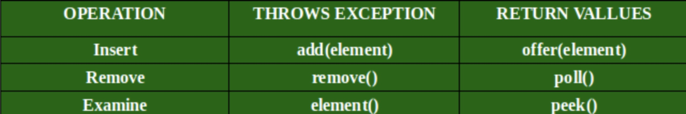

[TOC]

#java queue resource read
##总览
> Queue接口在java.util包中可用，并且扩展了Collection接口。 队列集合用于保存要处理的元素，并提供各种操作，如插入，删除等。它是对象的有序列表，其使用仅限于在列表末尾插入元素，并从头开始删除元素 列表，即遵循FIFO或先进先出原则。 作为一个接口，队列需要一个具体的类进行声明，最常见的类是Java中的PriorityQueue和LinkedList。需要注意的是，这两种实现都不是线程安全的。 如果需要线程安全的实现，PriorityBlockingQueue是一种替代实现。


##接口中声明了以下方法
1. `add()` - 此方法用于在队列尾部添加元素。 更具体地说，如果使用链表，则在链表的最后，或者在实施优先队列的情况下，根据优先级。

2. `remove()` - 此方法删除并返回队列的头部。 当队列为空时，它将引发NoSuchElementException。

3. `element()` - 此方法类似于peek（）。 当队列为空时，它将引发NoSuchElementException。

4. `offer()` -  此方法类似于add（）.在不违反容量限制的情况下,可以立即将指定的元素插入此队列。 当使用容量受限的队列时，此方法通常比add（E）更可取，因为add（E）仅通过抛出异常才能插入元素.

5. `poll()` - 此方法删除并返回队列的头部。 如果队列为空，则返回null。

6. `peek()` - 此方法用于查看队列头而不删除它。 如果队列为空，则返回Null。
7. `size()` - 此方法返回队列中的元素总量。

   

##LinkedList对queue接口的实现
示例代码:
```java
Queue<String> queue = new LinkedList<String>();
queue.offer("one");
queue.offer("two");
queue.offer("three");
queue.offer("four");
System.out.println(queue);
String polledElement = queue.poll();
System.out.println(polledElement);
System.out.println(queue);
String peekedElement = queue.peek();
System.out.println(peekedElement);
System.out.println(queue);
while(queue.size() > 0) {
  System.out.println(queue.poll());
}
```

```java 
//LinkList中的实现
public class LinkedList<E>
    extends AbstractSequentialList<E>
    implements List<E>, Deque<E>, Cloneable, java.io.Serializable
{

	  transient int size = 0;

    //Pointer to first node.
    transient Node<E> first;

    //Pointer to last node.
    transient Node<E> last;

	//1.Queue<String> queue = new LinkedList<String>();
	//构造方法
  public LinkedList() {
  }

  //2.queue.offer("one");
  //2.1
  public boolean offer(E e) {
      return add(e);
  }

  //2.2Appends the specified element to the end of this list.
  public boolean add(E e) {
      linkLast(e);
      return true;
  }
  //2.3Links e as last element.
  void linkLast(E e) {
      final Node<E> l = last;
      final Node<E> newNode = new Node<>(l, e, null);
      last = newNode;
      if (l == null)
          first = newNode;
      else
          l.next = newNode;
      size++;
      modCount++;//modCount用于记录操作数
  }
  
  //2.4 Node的类结构
  //LinkList是双向队列
  private static class Node<E> {
        E item;
        Node<E> next;
        Node<E> prev;

        Node(Node<E> prev, E element, Node<E> next) {
            this.item = element;
            this.next = next;
            this.prev = prev;
        }
  }
  
//modCount允许列表的内部知道是否进行了结构修改，从而可能导致当前操作给出错误的结果。
//如果您由于在迭代时修改列表（例如，删除项目）而遇ConcurrentModification
//Exception，其实迭代器以list的内部modCount为标记,检查list结构是否遭遇更改。
  
	//3.String polledElement = queue.poll();
	//3.1 Retrieves and removes the head (first element) of this list.
	public E poll() {
        final Node<E> f = first;
        return (f == null) ? null : unlinkFirst(f);
  }
  
  //3.2 Unlinks non-null first node f.
  private E unlinkFirst(Node<E> f) {
      // assert f == first && f != null;
      final E element = f.item;
      final Node<E> next = f.next;
      f.item = null;
      f.next = null; // help GC
      first = next;
      //需要 特殊考虑 poll()时元素只有一个的情况
      if (next == null)
          last = null;
      else
          next.prev = null;
      size--;
      modCount++;
      return element;
  }
  
  //4.String peekedElement = queue.peek();
  //Retrieves, but does not remove, the head (first element) of this list.
  public E peek() {
        final Node<E> f = first;
        return (f == null) ? null : f.item;
  }
}
```


