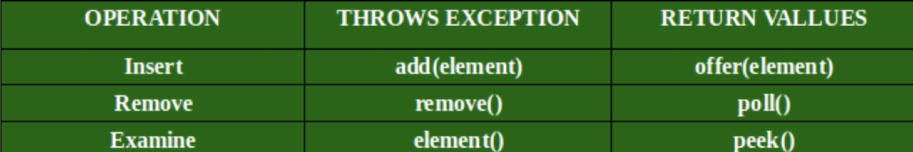
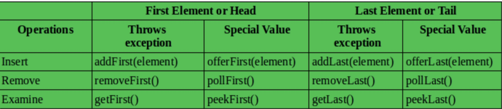

[TOC]

#栈和队列的实现与特性

##栈-stack
> 先进后出, 添加/删除皆为 O(1), 因为没有顺序,所以查询为O(n)

Methods in Stack class:
1. `Object push(Object element)` : Pushes an element on the top of the stack.
2. `Object pop()` : Removes and returns the top element of the stack. An ‘EmptyStackException’ exception is thrown if we call pop() when the invoking stack is empty.
3. `Object peek()` : Returns the element on the top of the stack, but does not remove it.
4. `boolean empty()` : It returns true if nothing is on the top of the stack. Else, returns false.
5. `int search(Object element)` : It determines whether an object exists in the stack. If the element is found, it returns the position of the element from the top of the stack. Else, it returns -1.

```java
Stack<Integer> stack = new Stack<>();
stack.push(1);
stack.push(2);
stack.push(3);
stack.push(4);
System.out.println(stack);
System.out.println(stack.search(4));
stack.pop();
stack.pop();
Integer topElement = stack.peek();
System.out.println(topElement);
System.out.println(" 3的位置 " + stack.search(3));
```

##队列-queue
> 先进先出, 添加/删除皆为 O(1), 因为没有顺序,所以查询为O(n)

Methods in Queue:
1. `add()` - This method is used to add elements at the tail of queue. More specifically, at the last of linked-list if it is used, or according to the priority in case of priority queue implementation.

2. `peek()` - This method is used to view the head of queue without removing it. It returns Null if the queue is empty.

3. `element()` - This method is similar to peek(). It throws NoSuchElementException when the queue is empty.

4. `remove()` - This method removes and returns the head of the queue. It throws NoSuchElementException when the queue is empty.

5. `poll()` - This method removes and returns the head of the queue. It returns null if the queue is empty.

6. `size()` - This method return the no. of elements in the queue.

   

```java
Queue<String> queue = new LinkedList<String>();
queue.offer("one");
queue.offer("two");
queue.offer("three");
queue.offer("four");
System.out.println(queue);
String polledElement = queue.poll();
System.out.println(polledElement);
System.out.println(queue);
String peekedElement = queue.peek();
System.out.println(peekedElement);
System.out.println(queue);
while(queue.size() > 0) {
  System.out.println(queue.poll());
}
```

##双端队列-Double-End Queue-Deque
> 俩端都可以push( )/pop( ), 添加/删除皆为 O(1), 因为没有顺序,所以查询为O(n)

Methods in Queue:
1. `add(element)` : Adds an element to the tail.

2. `addFirst(element)`  : Adds an element to the head.

3. `addLast(element)` : Adds an element to the tail.

4. `offer(element)` : Adds an element to the tail and returns a boolean to explain if the insertion was successful.

5. `offerFirst(element)` : Adds an element to the head and returns a boolean to explain if the insertion was successful.

6. `offerLast(element)` : Adds an element to the tail and returns a boolean to explain if the insertion was successful.

7. `iterator()` : Returna an iterator for this deque.

8. `descendingIterator()` : Returns an iterator that has the reverse order for this deque.

9. `push(element)` : Adds an element to the head.

10. `pop(element)` : Removes an element from the head and returns it.

11. `removeFirst()` : Removes the element at the head.

12. `removeLast()` : Removes the element at the tail.

13. `poll()` : Retrieves and removes the head of the queue represented by this deque (in other words, the first element of this deque), or returns null if this deque is empty.

14. `pollFirst()` : Retrieves and removes the first element of this deque, or returns null if this deque is empty.

15. `pollLast()` : Retrieves and removes the last element of this deque, or returns null if this deque is empty.

16. `peek()` : Retrieves, but does not remove, the head of the queue represented by this deque (in other words, the first element of this deque), or returns null if this deque is empty.

17. `peekFirst()` : Retrieves, but does not remove, the first element of this deque, or returns null if this deque is empty.

18. `peekLast()` : Retrieves, but does not remove, the last element of this deque, or returns null if this deque is empty.

   

   

   //使用新的API
```java
ArrayDeque<String> deque = new ArrayDeque<String>();
deque.offerFirst("zore");

deque.offerFirst("first");
deque.offerFirst("second");
deque.offerFirst("third");
System.out.println(deque);

String peekFirstString = deque.peekFirst();
System.out.println(peekFirstString);
System.out.println(deque);

while (deque.size() > 1) {
    System.out.println(deque.pollFirst());
}
System.out.println(deque);

System.out.println("========");

deque.offerLast("first");
deque.offerLast("second");
deque.offerLast("third");
System.out.println(deque);

String peekFirstString_1 = deque.peekLast();
System.out.println(peekFirstString_1);
System.out.println(deque);

while (deque.size() > 1) {
    System.out.println(deque.pollLast());
}
System.out.println(deque);

System.out.println("========");

System.out.println(deque.pollLast());
System.out.println(deque);
```

##优先队列-PriorityQueue
> 插入:O(1)
> 取出是O(logN),按照元素的优先级取出
> 顺序不是先去先出, 而是按照数据的优先级取出. 实例应用, 每次需要取最大值, 或者每次需要取出最小值
> 底层实现的数据结构,可以是多样, heap, bst(红黑树), treap